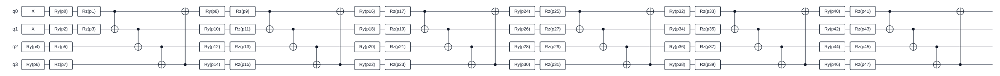

# 使用 ArcQML 求解 H₂ 基态能量

ArcQML 是一个用 Rust 语言原生实现的量子机器学习框架，提供了量子电路构建、状态向量模拟、可观测量期望值计算、自动微分和参数优化等核心能力。框架既支持单个量子态的计算，也支持批量状态模拟，并可使用 Pauli 算符及其线性组合表示可观测量。量子电路计算得到的期望值以可微分张量形式输出，可以继续参与损失函数及其他经典可微运算；执行反向传播时，梯度能够沿完整计算图传递至量子电路参数。对于含参量子电路，ArcQML 可以利用伴随法计算电路参数梯度，再与 Adam、SGD 等经典优化器配合完成混合量子—经典算法的训练。

这些能力可以用于变分量子本征求解、量子神经网络、量子态分析和小规模酉矩阵综合等任务。由于 Rust 语言具备原生编译、内存安全和高效并行等特性，ArcQML 能在保持可靠性的同时提供良好的计算性能。

本教程使用 ArcQML 实现一个完整的变分量子本征求解器 (Variational Quantum Eigensolver，VQE)，估计氢分子 H₂ 在给定几何结构、基组和活性空间下的基态能量。教程将依次说明电子结构问题如何转换为量子比特哈密顿量 (Hamiltonian)，如何构造量子电路与制备量子态，以及如何计算能量、获得梯度并更新参数。完整程序分别位于 [`examples/rust/h2_vqe.rs`](../../examples/rust/h2_vqe.rs) 和 [`examples/python/h2_vqe.py`](../../examples/python/h2_vqe.py)。

## 1. 准备运行环境

### 1.1 安装 Rust

Rust 的推荐安装工具是 `rustup`，详细说明见 [Rust 官方安装页面](https://www.rust-lang.org/tools/install)。ArcQML 使用 Rust 2024 edition，需要 Rust 1.85 或更新版本。

#### Windows

打开 Rust 官方安装页面，下载并运行 `RUSTUP-INIT.EXE`，按默认选项完成安装。重新打开 PowerShell 后检查版本：

```powershell
rustc --version
cargo --version
```

#### Linux

在终端中运行官方安装命令，并按默认选项完成安装：

```bash
curl --proto '=https' --tlsv1.2 -sSf https://sh.rustup.rs | sh
```

重新打开终端后检查版本：

```bash
rustc --version
cargo --version
```

如果 `rustc` 版本低于 1.85，可运行 `rustup update stable` 更新稳定版工具链。

### 1.2 进入框架目录

本教程默认将框架解压到以下通用目录；请把后续所有 `PATH_TO_YOUR_FILES` 替换为实际保存文件的位置：

```text
PATH_TO_YOUR_FILES/ArcQML
```

Runtime 部分代码通过 `libs` 文件夹中的预编译静态库进行链接。必须选择与操作系统和 Rust 编译目标匹配的库，Windows 与 Linux 的库不能混用。

#### Windows

Windows 64 位发布包应包含 `libs/x86_64-pc-windows-msvc/arcqml_runtime_private.lib`。在 PowerShell 中执行：

```powershell
Set-Location "PATH_TO_YOUR_FILES\ArcQML"
$env:ARCQML_RUNTIME_LIB_DIR = (Resolve-Path ".\libs\x86_64-pc-windows-msvc").Path
cargo check -p arcqml
```

#### Linux

Linux 64 位发布包应包含 `libs/x86_64-unknown-linux-gnu/libarcqml_runtime_private.a`。在终端中执行：

```bash
cd PATH_TO_YOUR_FILES/ArcQML
export ARCQML_RUNTIME_LIB_DIR="$PWD/libs/x86_64-unknown-linux-gnu"
cargo check -p arcqml
```

设置环境变量后应继续使用同一个 PowerShell 或 Linux 终端运行后续命令。第一次构建可能需要一些时间，之后 Cargo 会复用已经编译的依赖。

### 1.3（可选） 准备 Python API 的 Conda 环境

如果需要使用 ArcQML 的 Python API，请先安装 Anaconda 或 Miniconda，再根据 `wheels` 文件夹中的 `.whl` 文件创建匹配的 Python 环境。当前发布包包含：

```text
wheels/arcqml-0.1.0-cp311-cp311-manylinux_2_17_x86_64.manylinux2014_x86_64.whl
```

文件名中的 `cp311` 表示它需要 Python 3.11，`manylinux...x86_64` 表示它适用于 64 位 Linux。其它版本以及操作系统的版本我们将尽快发布。

#### Linux

以使用上述文件为例，在终端中执行：

```bash
cd PATH_TO_YOUR_FILES/ArcQML

# 创建名为 arcqml-example 的 Python 3.11 环境，并安装 pip
conda create --name arcqml-example python=3.11 pip -y

# 激活新环境；后续 Python 和 pip 命令都会在该环境中执行
conda activate arcqml-example

# 从本地 wheels 文件夹安装与当前平台匹配的 ArcQML wheel
python -m pip install ./wheels/arcqml-0.1.0-cp311-cp311-manylinux_2_17_x86_64.manylinux2014_x86_64.whl

# 验证 Python 能否成功导入 ArcQML
python -c "import arcqml; print('ArcQML imported successfully')"
```

输出 `ArcQML imported successfully` 即表示安装成功。

## 2. VQE 拟解决的问题

### 2.1 完整计算流程

一个分子可以处于许多能量不同的状态，其中能量最低的状态称为基态。分子的基态能量是预测分子稳定性、化学反应和材料性质的重要基础量。随着体系规模增大，直接在经典计算机上求大分子的最低能量所需的存储空间和计算时间呈指数级上涨。变分量子本征求解器 (Variational Quantum Eigensolver，VQE) 将量子设备用于制备参数化量子态并测量能量期望值，将经典计算机用于更新变分电路参数。通过这种量子和经典混合的方式，VQE 有效避免了在经典计算机中存储和对角化完整高维矩阵所带来的巨大开销。

VQE 是一种用于估计量子系统基态能量的量子—经典混合算法。设系统哈密顿量 $H$ 的最小本征值为 $E_0$，则对于任意归一化量子态 $\lvert\psi\rangle$，变分原理给出：

$$
\langle\psi\rvert H\lvert\psi\rangle\ge E_0.
$$

因此，可以构造包含参数 $\boldsymbol{\theta}$ 的量子电路 $U(\boldsymbol{\theta})$ 。选取易于制备的量子参考态 $\lvert\phi_{\mathrm{0}}\rangle$，利用参数化量子电路将其演化为参数化量子态 $\lvert\psi(\boldsymbol{\theta})\rangle$：

$$
\lvert\psi(\boldsymbol{\theta})\rangle
=U(\boldsymbol{\theta})\lvert\phi_{\mathrm{0}}\rangle.
$$

量子化学中的电子哈密顿量通常先写成由费米子产生算符和湮灭算符组成的二次量子化形式。选定活性电子和活性轨道后，再通过 Jordan–Wigner 等费米子到量子比特的映射，将其转换为量子计算可以处理的量子比特哈密顿量：

$$
H=\sum_j c_jP_j,
$$

其中 $c_j$ 是实数系数，$P_j$ 是由 Pauli X、Y、Z 和单位算符组成的 Pauli 字符串。最终对应的目标函数是该参数化量子态对哈密顿量的能量期望值：

$$
E(\boldsymbol{\theta})=
\langle\psi(\boldsymbol{\theta})\rvert
H
\lvert\psi(\boldsymbol{\theta})\rangle
=\sum_j c_j
\langle\psi(\boldsymbol{\theta})\rvert
P_j
\lvert\psi(\boldsymbol{\theta})\rangle.
$$

经典优化器依据测量结果迭代更新参数，使 $E(\boldsymbol{\theta})$ 逐步降低。最终得到的最小能量是基态能量 $E_0$ 的变分上界；当参数化电路能够表示基态且优化充分收敛时，该结果可逼近真实基态能量。

### 2.2 化学设置

本例采用以下量子化学设置：

| 配置 | 数值 |
| --- | --- |
| 分子几何 | H `(0, 0, -0.35 Å)`，H `(0, 0, 0.35 Å)` |
| 原子间距 | `0.70 Å` |
| 基组 | STO-3G |
| 活性电子数 | 2 |
| 活性轨道数 | 2 |
| 费米子映射 | Jordan–Wigner |
| 量子比特数 | 4 |
| Hamiltonian 项数 | 15 |
| 固定粒子数子空间维数 | 6 |
| Hartree–Fock 能量 | `-1.1173490350562805 Ha` |
| 精确基态能量 | `-1.1361894542078266 Ha` |

## 3. 初始化设置

首先导入 ArcQML 和标准库中的必要接口：

```rust
use arcqml::prelude::*;

// `AppResult<T>` 表示函数成功时返回 T，失败时返回可打印的错误
// 后续代码中的 `?` 会把错误自动交给调用者处理
type AppResult<T> = std::result::Result<T, Box<dyn std::error::Error>>;
```

```python
from __future__ import annotations

import json
import math
from pathlib import Path

import arcqml
```

示例中将主要数值集中声明为常量：

```rust
const NUM_QUBITS: usize = 4;       // H₂ 映射后需要 4 个量子比特
const ACTIVE_ELECTRONS: usize = 2; // Hartree–Fock 初态占据前 2 个位置
const LAYERS: usize = 6;           // 可训练电路重复 6 层
const STEPS: usize = 100;          // 共更新参数 100 次

const EXACT_GROUND_ENERGY: f64 = -1.136_189_454_207_826_6;    // 精确基态能量
const HARTREE_FOCK_ENERGY: f64 = -1.117_349_035_056_280_5;    // Hartree–Fock 能量（初态能量）

const CHEMICAL_ACCURACY: f64 = 1.6e-3;    // 化学精度误差阈值
```

```python
NUM_QUBITS = 4       # H₂ 映射后需要 4 个量子比特
ACTIVE_ELECTRONS = 2 # Hartree–Fock 初态占据前 2 个位置
LAYERS = 6           # 可训练电路重复 6 层
STEPS = 100          # 共更新参数 100 次

EXACT_GROUND_ENERGY = -1.136_189_454_207_826_6    # 精确基态能量
HARTREE_FOCK_ENERGY = -1.117_349_035_056_280_5    # Hartree–Fock 能量（初态能量）

CHEMICAL_ACCURACY = 1.6e-3    # 化学精度误差阈值
```

其中层数和训练步数是本示例选择的超参数，可以在后续实验中调整。

## 4. 哈密顿量构造

本示例的哈密顿量由第三方量子计算工具 PennyLane 生成。Jordan–Wigner 变换后，H₂ Hamiltonian 是 15 个 Pauli 字符串的实系数线性组合。ArcQML 的 Rust API 使用 `SparsePauliOp`，Python API 使用 `PauliSum` 保存若干带实数系数的 Pauli 项。Pauli X、Y、Z 是描述单个量子比特变化或测量的基本算符；把它们及其系数相加，就能表达本例的分子能量。Rust 通过 `include_str!` 在编译时读取 JSON，Python 则在运行时读取并逐项构造对象：

```rust
let hamiltonian = SparsePauliOp::from_json(include_str!(
    "../data/h2_hamiltonian.json"
))?;

// 确保导入的哈密顿量是 4 量子比特以及 15 项
assert_eq!(hamiltonian.num_qubits(), 4);
assert_eq!(hamiltonian.len(), 15);
```

```python
DATA_PATH = Path(__file__).resolve().parents[1] / "data" / "h2_hamiltonian.json"


def load_hamiltonian(path: Path) -> arcqml.PauliSum:
    # Python 公开 API 目前暂未实现直接接收 JSON 文本，因此逐项构造 PauliSum
    payload = json.loads(path.read_text(encoding="utf-8"))
    hamiltonian = arcqml.PauliSum(num_qubits=payload["num_qubits"])

    for term in payload["terms"]:
        coefficient = term["coefficient"]
        operations = term["paulis"]
        if not operations:
            # 单位算符
            hamiltonian.add_identity(coefficient=coefficient)
            continue
        hamiltonian.add_term(
            paulis="".join(operation["pauli"] for operation in operations),
            qubits=[operation["qubit"] for operation in operations],
            coefficient=coefficient,
        )
    return hamiltonian


hamiltonian = load_hamiltonian(path=DATA_PATH)
# 确保导入的哈密顿量是 4 量子比特以及 15 项
assert hamiltonian.num_qubits == 4
assert hamiltonian.num_terms == 15
```

ArcQML 的 JSON 格式由顶层 `num_qubits` 和 `terms` 组成；每个 Pauli 操作显式记录 `qubit` 与 `pauli`。例如常数项和 `X(q0)X(q1)Y(q2)Y(q3)` 项写作：

```json
{
  "num_qubits": 4,
  "terms": [
    {
      "coefficient": -0.042078985845795724,
      "paulis": []
    },
    {
      "coefficient": -0.04475014386992153,
      "paulis": [
        { "qubit": 0, "pauli": "X" },
        { "qubit": 1, "pauli": "X" },
        { "qubit": 2, "pauli": "Y" },
        { "qubit": 3, "pauli": "Y" }
      ]
    }
  ]
}
```

空 `paulis` 数组表示单位算符。

## 5. 初始量子态制备

`Circuit::new(4)` 创建一条 4 量子比特电路。模拟器的默认初始状态是 $\lvert0000\rangle$，即四个位置都未被占据。Jordan–Wigner 映射下，本例的两个活性电子占据编号最小的两个位置，因此对量子比特 0 和 1 施加 X 门，把对应位从 0 翻转为 1：

```rust
let mut circuit = Circuit::new(NUM_QUBITS)?;

// 依次对 qubit 0 和 qubit 1 施加 X 门
for qubit in 0..ACTIVE_ELECTRONS {
    circuit.x(qubit)?;
}
```

```python
circuit = arcqml.Circuit(num_qubits=NUM_QUBITS)

# 依次对 qubit 0 和 qubit 1 施加 X 门
for qubit in range(ACTIVE_ELECTRONS):
    circuit.x(qubit=qubit)
```

ArcQML 显示状态字符串时，量子比特编号从大到小排列，即 $q_3q_2q_1q_0$。所以量子比特 0 和 1 被置为 1 后，状态显示为 $\lvert0011\rangle$。

## 6. 变分量子电路构造

### 6.1 角度初始化

代码中的初始化公式是：

$$
\theta_k=0.04\sin(0.37k),\qquad k=1,2,\ldots,48.
$$

其中 `0.04` 是角度幅度，单位为弧度。它将所有旋转门的初始角限制在 $[-0.04,0.04]$，避免一开始就施加很大的单量子比特旋转。而 `0.37` 是相邻参数的固定相位步长，用于让相邻参数得到不同的非对称初值，避免 48 个角度全部相同。正弦函数让角度随参数编号平滑变化，并保证数值有正有负。

### 6.2 电路构造

本例使用 6 层硬件有效参数化量子线路。每层首先在每个量子比特上施加 RY、RZ，随后使用环形 CNOT 纠缠。对应代码如下：

```rust
let mut parameter_index = 0usize;

for _layer in 0..LAYERS {
    for qubit in 0..NUM_QUBITS {
        // 初始化角度
        let ry = 0.04 * (0.37 * (parameter_index + 1) as f64).sin();
        parameter_index += 1;

        let rz = 0.04 * (0.37 * (parameter_index + 1) as f64).sin();
        parameter_index += 1;

        // ry 和 rz 函数会把传入角度登记为可训练参数
        circuit.ry(ry, qubit)?;
        circuit.rz(rz, qubit)?;
    }

    for control in 0..NUM_QUBITS {
        // 环形 CNOT 纠缠
        let target = (control + 1) % NUM_QUBITS;
        circuit.cnot(control, target)?;
    }
}
```

```python
parameter_index = 0

for _layer in range(LAYERS):
    for qubit in range(NUM_QUBITS):
        # 初始化角度
        ry = 0.04 * math.sin(0.37 * (parameter_index + 1))
        parameter_index += 1

        rz = 0.04 * math.sin(0.37 * (parameter_index + 1))
        parameter_index += 1

        # ry 和 rz 函数会把传入角度登记为可训练参数
        circuit.ry(angle=ry, qubit=qubit)
        circuit.rz(angle=rz, qubit=qubit)

    for control in range(NUM_QUBITS):
        # 环形 CNOT 纠缠
        circuit.cnot(
            control=control,
            target=(control + 1) % NUM_QUBITS,
        )
```

电路结构如下：



该硬件有效参数化量子线路不严格保持粒子数。它适合演示通用 VQE 和 ArcQML 自动微分。在化学计算中也可以改用保持粒子数的激发电路。

## 7. 模拟器创建和优化器选择

### 7.1 状态向量模拟器

```rust
let simulator = StateVectorSimulator::new(NUM_QUBITS)?;
```

```python
simulator = arcqml.StateVectorSimulator(num_qubits=NUM_QUBITS)
```

模拟器从 $\lvert0000\rangle$ 开始执行整条电路。Hartree–Fock 制备门已经放在线路最前面，所以每次计算都会先得到 $\lvert0011\rangle$，再执行后续可训练量子电路。

Rust 的 `simulator.run(&circuit, &hamiltonian)` 与 Python 的 `simulator.run(circuit=circuit, observable=hamiltonian)` 都不会永久改变模拟器保存的初始状态，因此同一个模拟器可以在全部训练步骤中重复使用。

### 7.2 Adam 优化器

普通梯度下降对所有参数使用同一个固定更新尺度。Adam 会为每个参数分别记录近期梯度的平均趋势和梯度平方的平均趋势，据此自动调节每个参数的实际更新幅度。

```rust
let mut optimizer = Adam::new(
    0.05,  // 学习率
    0.9,   // beta1
    0.999, // beta2
    1e-8,  // epsilon
    0.0,   // weight_decay
)?;
```

```python
# 其余可选参数采用与 Rust 代码相同的默认值
optimizer = arcqml.Adam(learning_rate=0.05)
```

该超参数组合不适用于所有分子和电路。如果训练效果不好，该部分超参数也可能需要重新调整。

## 8. 执行 VQE 优化

一次训练迭代包含四个步骤：

1. 前向计算当前能量。
2. 从能量反向计算 48 个参数的梯度。
3. Adam 根据梯度更新参数。
4. 清空本轮梯度，避免它们与下一轮结果累加。

```rust
for step in 1..=STEPS {
    // 前向计算当前能量
    let energy = simulator.run(&circuit, &hamiltonian)?;

    // 反向计算所有可训练角度的梯度
    energy.backward()?;

    // 优化器读取梯度并更新参数
    optimizer.step(circuit.parameters())?;

    // 清空本轮梯度
    optimizer.zero_grad(circuit.parameters());

    // 第 1 步和之后每 10 步打印一次更新后的能量
    if step == 1 || step % 10 == 0 {
        let current = simulator.run(&circuit, &hamiltonian)?.value()?;
        println!("step {step:>3}: energy = {current:.12} Ha");
    }
}
```

```python
for step in range(1, STEPS + 1):
    # 前向计算当前能量
    energy_tensor = simulator.run(circuit=circuit, observable=hamiltonian)

    # 反向计算所有可训练角度的梯度
    energy_tensor.backward()

    # 优化器读取梯度并更新参数
    optimizer.step(circuit=circuit)

    # 清空本轮梯度
    optimizer.zero_grad(circuit=circuit)

    # 第 1 步和之后每 10 步打印一次更新后的能量
    if step == 1 or step % 10 == 0:
        with arcqml.no_grad():
            current = simulator.run(
                circuit=circuit,
                observable=hamiltonian,
            ).item()
        print(f"step {step:>3}: energy = {current:.12f} Ha")
```

`run` 返回的是 `Tensor`，调用 `backward()` 时，ArcQML 根据这份记录自动计算梯度。第一次迭代前参数还没有梯度，所以不需要预先调用 `zero_grad`；第一次反向之后，每轮都必须清零。

## 9. 运行完整示例

### 9.1 运行 Rust 版本

在第 1.2 节已经设置 `ARCQML_RUNTIME_LIB_DIR` 的同一个 Windows PowerShell 或 Linux 终端中执行：

```text
cargo run --release -p arcqml --example h2_vqe
```

### 9.2 运行 Python 版本

先按照第 1.3 节安装 wheel 并激活 Conda 环境，再从 ArcQML 根目录执行：

```text
conda activate arcqml-example
python examples/python/h2_vqe.py
```

### 9.3 输出示例

程序每 10 步输出一次能量以及相对精确基态能量的绝对误差，最后判断是否达到化学精度：

```text
H2/STO-3G, Jordan-Wigner, 4 qubits
Hamiltonian terms : 15
Trainable params  : 48
Hartree-Fock      : -1.117349035056 Ha
Exact ground      : -1.136189454208 Ha
step   1: energy = -0.401257301811 Ha, |error| = 7.349e-1 Ha
...
step 100: energy = -1.136145412038 Ha, |error| = 4.404e-5 Ha

VQE energy        : -1.136145412038 Ha
Absolute error    : 4.404217e-5 Ha
Chemical accuracy: reached (threshold 1.6e-3 Ha)
```


## 10. 如何理解结果

- 能量应从初始值总体向下收敛，并受变分原理约束，不应显著低于精确基态能量。
- Hartree–Fock 与精确能量之差约为 `0.0188404 Ha`，这部分差异主要来自电子关联。
- 绝对误差小于 `1.6 × 10⁻³ Ha` 时，通常称为达到化学精度。
- 若 100 步尚未收敛，可增加训练步数、调整学习率，或增加电路层数；更深电路也更可能出现优化平台或冗余参数。

## 11. 下一步

可以在此示例上继续尝试：

- 将 `Adam` 替换为 `Sgd`，比较收敛速度。
- 使用保持粒子数的激发电路，限制搜索空间到 6 维双电子子空间。
- 保存训练后的电路权重，并在新进程中通过 `load_weights` 恢复。
- 改变 H–H 键长，计算势能曲线。
