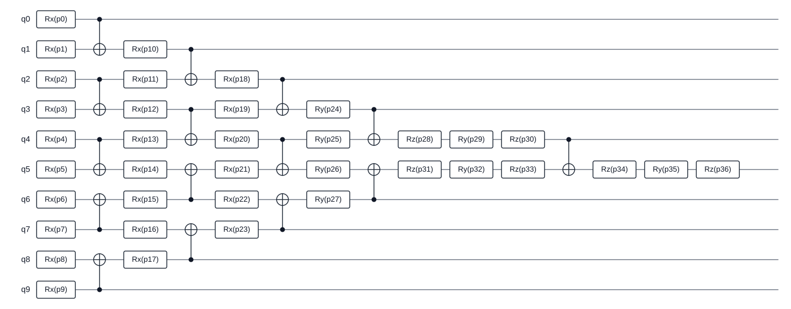

# 使用 ArcQML 构建量子神经网络分类器

ArcQML 是一个用 Rust 语言原生实现的量子机器学习框架，提供了量子电路构建、状态向量模拟、可观测量期望值计算、自动微分和参数优化等核心能力。框架既支持单个量子态的计算，也支持批量状态模拟，并可使用 Pauli 算符及其线性组合表示可观测量。量子电路计算得到的期望值以可微分张量形式输出，可以继续参与损失函数及其他经典可微运算；执行反向传播时，梯度能够沿完整计算图传递至量子电路参数。对于含参量子电路，ArcQML 可以利用伴随法计算电路参数梯度，再与 Adam、SGD 等经典优化器配合完成混合量子—经典算法的训练。

这些能力可以用于变分量子本征求解、量子神经网络、量子态分析和小规模酉矩阵综合等任务。由于 Rust 语言具备原生编译、内存安全和高效并行等特性，ArcQML 能在保持可靠性的同时提供良好的计算性能。

本教程使用 ArcQML 实现一个完整的二分类任务，选取德国信用数据集中的 10 个特征，预测申请者是否属于“信用不良”类别。教程将依次说明数据预处理、量子态编码、构造量子电路与制备量子态、计算二元交叉熵损失、参数优化以及验证和测试。完整程序分别位于 [`examples/rust/qnn_german_credit.rs`](../../examples/rust/qnn_german_credit.rs) 和 [`examples/python/qnn_german_credit.py`](../../examples/python/qnn_german_credit.py)。


## 1. 准备运行环境

### 1.1 安装 Rust

Rust 的推荐安装工具是 `rustup`，详细说明见 [Rust 官方安装页面](https://www.rust-lang.org/tools/install)。ArcQML 使用 Rust 2024 edition，需要 Rust 1.85 或更新版本。

#### Windows

打开 Rust 官方安装页面，下载并运行 `RUSTUP-INIT.EXE`，按默认选项完成安装。重新打开 PowerShell 后检查版本：

```powershell
rustc --version
cargo --version
```

#### Linux

在终端中运行官方安装命令，并按默认选项完成安装：

```bash
curl --proto '=https' --tlsv1.2 -sSf https://sh.rustup.rs | sh
```

重新打开终端后检查版本：

```bash
rustc --version
cargo --version
```

如果 `rustc` 版本低于 1.85，可运行 `rustup update stable` 更新稳定版工具链。

### 1.2 进入框架目录

本教程默认将框架解压到以下通用目录；请把后续所有 `PATH_TO_YOUR_FILES` 替换为实际保存文件的位置：

```text
PATH_TO_YOUR_FILES/ArcQML
```

Runtime 部分代码通过 `libs` 文件夹中的预编译静态库进行链接。必须选择与操作系统和 Rust 编译目标匹配的库，Windows 与 Linux 的库不能混用。

#### Windows

Windows 64 位发布包应包含 `libs/x86_64-pc-windows-msvc/arcqml_runtime_private.lib`。在 PowerShell 中执行：

```powershell
Set-Location "PATH_TO_YOUR_FILES\ArcQML"
$env:ARCQML_RUNTIME_LIB_DIR = (Resolve-Path ".\libs\x86_64-pc-windows-msvc").Path
cargo check -p arcqml
```

#### Linux

Linux 64 位发布包应包含 `libs/x86_64-unknown-linux-gnu/libarcqml_runtime_private.a`。在终端中执行：

```bash
cd PATH_TO_YOUR_FILES/ArcQML
export ARCQML_RUNTIME_LIB_DIR="$PWD/libs/x86_64-unknown-linux-gnu"
cargo check -p arcqml
```

设置环境变量后应继续使用同一个 PowerShell 或 Linux 终端运行后续命令。第一次构建可能需要一些时间，之后 Cargo 会复用已经编译的依赖。

### 1.3（可选） 准备 Python API 的 Conda 环境

如果需要使用 ArcQML 的 Python API，请先安装 Anaconda 或 Miniconda，再根据 `wheels` 文件夹中的 `.whl` 文件创建匹配的 Python 环境。当前发布包包含：

```text
wheels/arcqml-0.1.0-cp311-cp311-manylinux_2_17_x86_64.manylinux2014_x86_64.whl
```

文件名中的 `cp311` 表示它需要 Python 3.11，`manylinux...x86_64` 表示它适用于 64 位 Linux。其它版本以及操作系统的版本我们将尽快发布。

#### Linux

以使用上述文件为例，在终端中执行：

```bash
cd PATH_TO_YOUR_FILES/ArcQML

# 创建名为 arcqml-example 的 Python 3.11 环境，并安装 pip。
conda create --name arcqml-example python=3.11 pip -y

# 激活新环境；后续 Python 和 pip 命令都会在该环境中执行。
conda activate arcqml-example

# 从本地 wheels 文件夹安装与当前平台匹配的 ArcQML wheel。
python -m pip install ./wheels/arcqml-0.1.0-cp311-cp311-manylinux_2_17_x86_64.manylinux2014_x86_64.whl

# 验证 Python 能否成功导入 ArcQML。
python -c "import arcqml; print('ArcQML imported successfully')"
```

输出 `ArcQML imported successfully` 即表示安装成功。

## 2. QNN 拟解决的问题

### 2.1 从经典数据到二分类结果

二分类是一类监督学习任务，其目标是根据输入特征学习一个判别函数，将样本划分到两个互斥类别之一。数据集中的 `Creditability` 字段将每条信用记录分为：

- `0`：信用不良，占总数据的 30％；
- `1`：信用良好，占总数据的 70％。

在本教程中，量子神经网络（QNN）被构造为参数化二分类模型。每条记录首先经过预处理并编码成特定的量子态；随后，不同样本通过同一条可训练的含参量子电路。电路末端测量第 5 号量子比特的 Pauli-Z 期望值，并将该连续值作为二分类的分类分数 (logit)。训练阶段以真实标签作为监督信号，通过最小化二元交叉熵损失更新量子电路参数，使模型输出更符合训练数据的类别分布，最终的预测类别会与真实类别逐渐一致。

### 2.2 数据与教学配置

[下载 German Credit 数据集](../../examples/data/german_credit.csv)

本示例使用的德国信用数据集包含 1000 条申请人的信用记录，通过账户状况、还款历史、贷款用途、就业情况和资产状况等特征，将申请人划分为信用良好与信用不良两类。教学示例采用以下配置：

| 配置 | 数值 | 作用 |
| --- | --- | --- |
| 量子比特数 | 10 | 每个特征对应一个量子比特。 |
| 状态向量长度 | $2^{10}=1024$ | 10 量子比特量子态包含 1024 个复数振幅。 |
| QNN 层数 | 1 | 控制可训练电路的深度。 |
| 每层参数数 | 37 | 由本例的旋转门结构决定。 |
| 训练/验证/测试 | 800/100/100 | 分别用于训练、调试观察和最终评估。 |
| 每批样本数 | 100 | 每次共同计算损失并更新参数的样本数。 |
| 训练轮数 | 5 | 完整遍历训练集 5 次。 |
| Adam 学习率 | 0.01 | 控制每次参数更新的总体幅度。 |
| 随机种子 | 4 | 让同一语言中的数据划分和初始化可以复现。 |

程序选取以下 10 个特征：`Account Balance`，`Payment Status of Previous Credit`，`Purpose`，`Value Savings/Stocks`，`Length of current employment`，`Guarantors`，`Most valuable available asset`，`Concurrent Credits`，`Type of apartment`，`No of Credits at this Bank`，每个特征对应一个量子比特。

## 3. 初始化设置

首先导入 ArcQML、文件读取和数值计算所需的接口：

```rust
use arcqml::prelude::*;
use num_complex::Complex64;
use std::{f64::consts::PI, fs};

// `AppResult<T>` 表示成功时返回 T，失败时返回可打印的错误
// 后续代码中的 `?` 会把错误自动交给调用者处理
type AppResult<T> = std::result::Result<T, Box<dyn std::error::Error>>;
```

```python
from __future__ import annotations

import csv
from pathlib import Path

import numpy as np
import arcqml
```

示例中将主要数值集中声明为常量：

```rust
const QUBITS: usize = 10;                   // 10 个特征对应 10 个量子比特
const STATE_DIMENSION: usize = 1 << QUBITS; // 即 2^10 = 1024
const PARAMETERS_PER_LAYER: usize = 37;     // 由后续声明的电路结构决定
const LAYERS: usize = 1;                    // 教程只使用 1 层，降低运行成本
const EPOCHS: usize = 5;                    // 完整遍历训练集 5 次
const BATCH_SIZE: usize = 100;              // 每次处理 100 条记录
const LEARNING_RATE: f64 = 0.01;            // Adam 的学习率
const SEED: u64 = 4;                        // 固定种子用于复现
const DATA_PATH: &str = "examples/data/german_credit.csv";
```

```python
QUBITS = 10                    # 10 个特征对应 10 个量子比特
STATE_DIMENSION = 1 << QUBITS  # 即 2**10 = 1024
PARAMETERS_PER_LAYER = 37      # 由后续声明的电路结构决定。
LAYERS = 1                     # 教程只使用 1 层，降低运行成本
EPOCHS = 5                     # 完整遍历训练集 5 次
BATCH_SIZE = 100               # 每次处理 100 条记录
LEARNING_RATE = 0.01           # Adam 的学习率
SEED = 4                       # 固定种子用于复现
DATA_PATH = Path(__file__).resolve().parents[1] / "data" / "german_credit.csv"
```

部分超参数可以在后续实验中调整。

## 4. 读取和预处理数据

### 4.1 标签读取

数据集中的 `Creditability` 列中，`1` 表示信用良好，`0` 表示信用不良。本示例将“信用不良”作为正类 `1`：

```rust
// 读取标签列
let label_column = headers
    .iter()
    .position(|name| *name == "Creditability")
    .ok_or("missing Creditability column")?;

let creditability: u8 = fields[label_column].parse()?;

// 原始值 1（信用良好）转为标签 0，原始值 0（信用不良）转为标签 1
let label = f64::from(1 - creditability);
```

```python
labels = np.asarray(
    [1.0 - float(row["Creditability"]) for row in rows],
    dtype=np.float64,
)
```

### 4.2 特征预处理

数据集中的原始特征均是离散数值，不能不加处理地作为旋转角。示例对每一特征列独立执行 min-max 缩放：

$$
x'=\frac{\pi}{2}+\frac{x-x_{\min}}{x_{\max}-x_{\min}}\pi.
$$

其中 $x_{\min}$ 和 $x_{\max}$ 是当前特征列在全部 1000 条记录中的最小值和最大值。转换后，每个特征都落在 $[\pi/2,3\pi/2]$，可以直接作为 `RX` 和 `RZ` 门的旋转角。

```rust
for column in 0..QUBITS {
    let minimum = samples
        .iter()
        .map(|sample| sample.features[column])
        .fold(f64::INFINITY, f64::min);
    let maximum = samples
        .iter()
        .map(|sample| sample.features[column])
        .fold(f64::NEG_INFINITY, f64::max);

    for sample in &mut samples {
        // 把当前特征列缩放到 [π/2, 3π/2]，得到角度编码所需的弧度值
        sample.features[column] =
            PI / 2.0
            + (sample.features[column] - minimum) / (maximum - minimum) * PI;
    }
}
```

```python
minimum = features.min(axis=0)
maximum = features.max(axis=0)

# 把当前特征列缩放到 [π/2, 3π/2]，得到角度编码所需的弧度值
features = (
    np.pi / 2.0
    + (features - minimum) / (maximum - minimum) * np.pi
)
```

如果某一列所有值都相同，就会出现 $x_{\max}-x_{\min}=0$。本例选取的 10 列不存在该情况；如需替换特征列时应先检查并排除常量列，或为它们单独指定固定角度进行编码。

### 4.3 集合划分

程序先打乱记录，再按训练集：验证集：测试集以 8:1:1 的比例划分：

```rust
Rng::new(SEED).shuffle(&mut samples);
let test_samples = samples.split_off(900);        // 测试集
let validation_samples = samples.split_off(800);  // 验证集
let training_samples = samples;                   // 训练集
```

```python
rng = np.random.default_rng(seed=SEED)
shuffled_indices = rng.permutation(len(features))
training_indices = shuffled_indices[:800]         # 训练集
validation_indices = shuffled_indices[800:900]    # 验证集
test_indices = shuffled_indices[900:]             # 测试集
```

## 5. 初始量子态制备

### 5.1 角度编码

每条记录包含 10 个缩放后的角度 $x'_0,x'_1,\ldots,x'_9$。本例在第 $i$ 个量子比特上先施加 `RX(x'_i)`，再施加 `RZ(x'_i)`。这种把经典数值作为量子门角度的方式称为**角度编码**。

单个量子比特从 $\lvert0\rangle$ 出发，编码后为：

$$
R_Z(x')R_X(x')\lvert0\rangle=
e^{-ix'/2}\cos(x'/2)\lvert0\rangle
-i e^{ix'/2}\sin(x'/2)\lvert1\rangle.
$$

10 个量子比特在编码阶段互不纠缠，因此整条记录的编码结果是 10 个局部量子态的张量积。每条记录最终得到一个长度为 $2^{10}=1024$ 的复数状态向量。

### 5.2 量子态制备

为了防止将 `RX(x'_i)` 和 `RZ(x'_i)` 直接加入可训练电路导致 ArcQML 将这些角度也登记成参数，示例预先计算与这些门完全等价的量子态编码结果，再让整组样本共用一条只包含 37 个可训练参数的电路。

```rust
fn encode_product_states(samples: &[Sample]) -> AppResult<Tensor> {
    let mut encoded_amplitudes =
        Vec::with_capacity(samples.len() * STATE_DIMENSION);

    for sample in samples {
        let mut encoded_state = vec![Complex64::new(1.0, 0.0)];

        // 按 q9、q8、...、q0 的顺序展开，使最终振幅索引与 ArcQML 一致
        for qubit in (0..QUBITS).rev() {
            let angle = sample.features[qubit];
            let half_angle = angle / 2.0;
            let amplitude_zero =
                Complex64::from_polar(1.0, -half_angle) * half_angle.cos();
            let amplitude_one = Complex64::new(0.0, -1.0)
                * Complex64::from_polar(1.0, half_angle)
                * half_angle.sin();

            let mut expanded_state = Vec::with_capacity(encoded_state.len() * 2);
            for amplitude in encoded_state {
                expanded_state.push(amplitude * amplitude_zero);
                expanded_state.push(amplitude * amplitude_one);
            }
            encoded_state = expanded_state;
        }
        encoded_amplitudes.extend(encoded_state);
    }

    Ok(Tensor::new(TensorData::FlatC64 {
        data: encoded_amplitudes,
        shape: vec![samples.len(), STATE_DIMENSION],
    })?)
}
```

```python
def encode_product_states(features: np.ndarray) -> np.ndarray:
    """把角度编码直接转换为一组乘积量子态。"""
    encoded_states = np.ones((len(features), 1), dtype=np.complex128)

    # 按 q9、q8、...、q0 的顺序展开，使最终振幅索引与 ArcQML 一致
    for qubit in range(QUBITS - 1, -1, -1):
        angles = features[:, qubit]
        local_encoded_states = np.column_stack(
            (
                np.exp(-0.5j * angles) * np.cos(0.5 * angles),
                -1j * np.exp(0.5j * angles) * np.sin(0.5 * angles),
            )
        )
        encoded_states = np.einsum(
            "bi,bj->bij",
            encoded_states,
            local_encoded_states,
        ).reshape(len(features), -1)

    assert encoded_states.shape == (len(features), STATE_DIMENSION)
    return np.ascontiguousarray(encoded_states, dtype=np.complex128)
```

每条记录得到一个**量子态编码结果**，若干结果组成形状为 `[样本数, 1024]` 的**批量量子态数组**。

## 6. 变分量子电路构造

### 6.1 单层电路结构

角度编码只负责放入输入数据，真正接受优化器更新的是变分量子电路中的可训练参数。示例中构造的电路包含 1 层，每层由 37 个旋转门和 15 个 CNOT 门组成，共 52 个门。旋转门提供可训练角度，CNOT 门让不同量子比特建立关联。可以通过调整 `LAYERS` 从而调整示例中的电路层数。

```rust
fn append_ansatz_layer(circuit: &mut Circuit, values: &[f64]) -> AppResult<()> {
    if values.len() != PARAMETERS_PER_LAYER {
        return Err("each ansatz layer requires 37 parameters".into());
    }
    for qubit in 0..QUBITS {
        circuit.rx(values[qubit], qubit)?;
    }
    for (control, target) in [(0, 1), (2, 3), (4, 5), (9, 8), (7, 6)] {
        circuit.cnot(control, target)?;
    }
    for qubit in 1..9 {
        circuit.rx(values[9 + qubit], qubit)?;
    }
    for (control, target) in [(1, 2), (3, 4), (8, 7), (6, 5)] {
        circuit.cnot(control, target)?;
    }
    for qubit in 2..8 {
        circuit.rx(values[16 + qubit], qubit)?;
    }
    for (control, target) in [(2, 3), (4, 5), (7, 6)] {
        circuit.cnot(control, target)?;
    }
    for (parameter, qubit) in [(24, 3), (25, 4), (26, 5), (27, 6)] {
        circuit.ry(values[parameter], qubit)?;
    }
    circuit.cnot(3, 4)?.cnot(6, 5)?;
    circuit
        .rz(values[28], 4)?
        .ry(values[29], 4)?
        .rz(values[30], 4)?;
    circuit
        .rz(values[31], 5)?
        .ry(values[32], 5)?
        .rz(values[33], 5)?;
    circuit.cnot(4, 5)?;
    circuit
        .rz(values[34], 5)?
        .ry(values[35], 5)?
        .rz(values[36], 5)?;
    Ok(())
}
```

```python
def append_ansatz_layer(circuit: arcqml.Circuit, values: np.ndarray) -> None:
    if values.shape != (PARAMETERS_PER_LAYER,):
        raise ValueError("each ansatz layer requires 37 parameters")
    for qubit in range(QUBITS):
        circuit.rx(angle=float(values[qubit]), qubit=qubit)
    for control, target in ((0, 1), (2, 3), (4, 5), (9, 8), (7, 6)):
        circuit.cnot(control=control, target=target)
    for qubit in range(1, 9):
        circuit.rx(angle=float(values[9 + qubit]), qubit=qubit)
    for control, target in ((1, 2), (3, 4), (8, 7), (6, 5)):
        circuit.cnot(control=control, target=target)
    for qubit in range(2, 8):
        circuit.rx(angle=float(values[16 + qubit]), qubit=qubit)
    for control, target in ((2, 3), (4, 5), (7, 6)):
        circuit.cnot(control=control, target=target)
    for parameter, qubit in ((24, 3), (25, 4), (26, 5), (27, 6)):
        circuit.ry(angle=float(values[parameter]), qubit=qubit)
    circuit.cnot(control=3, target=4)
    circuit.cnot(control=6, target=5)
    circuit.rz(angle=float(values[28]), qubit=4)
    circuit.ry(angle=float(values[29]), qubit=4)
    circuit.rz(angle=float(values[30]), qubit=4)
    circuit.rz(angle=float(values[31]), qubit=5)
    circuit.ry(angle=float(values[32]), qubit=5)
    circuit.rz(angle=float(values[33]), qubit=5)
    circuit.cnot(control=4, target=5)
    circuit.rz(angle=float(values[34]), qubit=5)
    circuit.ry(angle=float(values[35]), qubit=5)
    circuit.rz(angle=float(values[36]), qubit=5)
```

电路结构如下：



### 6.2 初始化角度

本示例从均值为 0、标准差为 1 的标准正态分布生成 37 个可训练角度。

```rust
let mut rng = Rng::new(SEED);

// 创建电路
let mut circuit = Circuit::new(QUBITS)?;

for _layer in 0..LAYERS {
    // 生成标准正态分布初值
    let initial_angles: Vec<f64> = (0..PARAMETERS_PER_LAYER)
        .map(|_| rng.normal())
        .collect();
    append_ansatz_layer(&mut circuit, &initial_angles)?;
}
```

```python
rng = np.random.default_rng(seed=SEED)

# 创建电路
circuit = arcqml.Circuit(num_qubits=QUBITS)

for _layer in range(LAYERS):
    # 生成标准正态分布初值
    initial_angles = rng.standard_normal(PARAMETERS_PER_LAYER)
    append_ansatz_layer(circuit=circuit, values=initial_angles)
```

## 7. 期望值测量

本实例选择测量第 5 号量子比特的 Pauli-Z 期望值。选择 `q5` 是本例电路结构的固定设计，因为它聚合了所有特征的全部信息。

```rust
let observable = SparsePauliOp::single(
    QUBITS,
    5usize,  // 测量 q5
    Pauli::Z,
    1.0,     // Pauli-Z 项的系数
)?;
```

```python
observable = arcqml.PauliSum.z(
    num_qubits=QUBITS,
    qubit=5,            # 测量 q5
    coefficient=1.0,    # Pauli-Z 项的系数
)
```

对第 $i$ 个样本，模型输出为：

$$
z_i=
\langle\psi(x'_i,\boldsymbol{\theta})\rvert
Z_5
\lvert\psi(x'_i,\boldsymbol{\theta})\rangle.
$$

其中 $x'_i$ 表示输入的编码后特征，$\boldsymbol{\theta}$ 表示电路中的可训练角度。Pauli-Z 期望值位于 $[-1,1]$，本例把 $z_i$ 直接作为二分类的 logit，再通过 sigmoid 函数解释为正类概率：

$$
p_i=\sigma(z_i)=\frac{1}{1+e^{-z_i}}.
$$

$z_i\ge0$ 等价于 $p_i\ge0.5$，因此预测为信用不良；$z_i<0$ 则预测为信用良好。

## 8. 损失函数定义

损失函数把一组预测和已知标签归纳成一个需要最小化的数值。本例使用带 logit 的二元交叉熵。对于包含 $N$ 条记录的一批数据，损失为：

$$
\mathcal{L}=-\frac{1}{N}\sum_{i=1}^{N}
\left[
y_i\log\sigma(z_i)
+(1-y_i)\log\left(1-\sigma(z_i)\right)
\right].
$$

如果标签 $y_i=1$，损失会推动 $z_i$ 增大；如果 $y_i=0$，损失会推动 $z_i$ 减小。

```rust
let targets = labels(training_samples)?;
let loss = binary_cross_entropy_with_logits_loss(
    &logits,
    &targets,
)?;

// loss 是整批样本二元交叉熵的平均值，而不是某一个样本的损失
let loss_value = loss.value()?;
```

```python
targets = arcqml.tensor(
    np.ascontiguousarray(training_labels, dtype=np.float64)
)
loss = arcqml.binary_cross_entropy_with_logits(
    logits=logits,
    targets=targets,
)

# loss 是整批样本二元交叉熵的平均值，而不是某一个样本的损失
loss_value = float(loss.item())
```

损失越小，说明当前预测与标签越一致。通过不断迭代优化量子电路中的可训练参数从而最小化损失函数，能够有效使模型输出的分类分数逐渐逼近标签所对应的目标，从而提高模型对样本类别的预测能力。

## 9. 模拟器创建和优化器选择

### 9.1 状态向量模拟器

```rust
// 从给定状态创建模拟器
let simulator = BatchStateVectorSimulator::from_state_tensor(QUBITS, states)?;
```

```python
# 从给定状态创建模拟器
simulator = arcqml.BatchStateVectorSimulator.from_amplitudes(
                num_qubits=QUBITS,
                amplitudes=np.ascontiguousarray(states[batch_indices]),
            )
```

模拟器从给定的 `states` 开始执行整条电路。Rust 的 `simulator.run(circuit, observable)` 与 Python 的 `simulator.run(circuit=circuit, observable=observable)` 都不会永久改变模拟器保存的初始状态，因此同一个模拟器可以在全部训练步骤中重复使用。

### 9.2 Adam 优化器

普通梯度下降对所有参数使用同一个固定更新尺度。Adam 会为每个参数分别记录近期梯度的平均趋势和梯度平方的平均趋势，据此自动调节每个参数的实际更新幅度。

```rust
let mut optimizer = Adam::new(
    0.05,  // 学习率
    0.9,   // beta1
    0.999, // beta2
    1e-8,  // epsilon
    0.0,   // weight_decay
)?;
```

```python
# 其余可选参数采用与 Rust 代码相同的默认值
optimizer = arcqml.Adam(learning_rate=0.05)
```

该超参数组合不适用于所有任务和电路。如果训练效果不好，该部分超参数也可能需要重新调整。

## 10. 批量前向计算与反向传播

一次训练迭代包含四个步骤：

1. 前向计算当前损失值。
2. 从损失值反向计算所有参数的梯度。
3. Adam 根据梯度更新参数。
4. 清空本轮梯度，避免它们与下一轮结果累加。

```rust
// 本部分为伪代码，仅供演示

// logits 的形状是 [批样本数]，每个元素对应一条记录的 Z(q5) 期望值
let logits = simulator.run(circuit, observable)?;

// 前向计算当前损失值
let loss = binary_cross_entropy_with_logits_loss(&logits, &targets)?;

// 从损失值反向计算所有参数的梯度
loss.backward()?;

// Adam 根据梯度更新参数
optimizer.step(circuit.parameters())?;

// 清空本轮梯度，避免它们与下一轮结果累加
optimizer.zero_grad(circuit.parameters());
```

```python
# 本部分为伪代码，仅供演示

# logits 的形状是 [批样本数]，每个元素对应一条记录的 Z(q5) 期望值
logits = simulator.run(circuit=circuit, observable=observable)

# 前向计算当前损失值
loss = arcqml.binary_cross_entropy_with_logits(
    logits=logits,
    targets=targets,
)

# 从损失值反向计算所有参数的梯度
loss.backward()

# Adam 根据梯度更新参数
optimizer.step(circuit=circuit)

# 清空本轮梯度，避免它们与下一轮结果累加
optimizer.zero_grad(circuit=circuit)
```

`run` 返回的是 `Tensor`，调用 `backward()` 时，ArcQML 根据这份记录自动计算梯度。第一次迭代前参数还没有梯度，所以不需要预先调用 `zero_grad`；第一次反向之后，每轮都必须清零。

## 11. 验证与测试

验证和测试只读取模型输出，不更新参数，因此应关闭梯度记录。这样可以减少不必要的计算过程记录和内存占用：

```rust
let _guard = no_grad();
let encoded_states = encode_product_states(evaluation_samples)?;
let simulator = BatchStateVectorSimulator::from_state_tensor(
    QUBITS,
    encoded_states,
)?;
let logits = simulator.run(&circuit, &observable)?;

// `_guard` 离开当前作用域时自动恢复梯度记录
```

```python
encoded_state_batch = np.ascontiguousarray(
    evaluation_encoded_states,
    dtype=np.complex128,
)
simulator = arcqml.BatchStateVectorSimulator.from_amplitudes(
    num_qubits=QUBITS,
    amplitudes=encoded_state_batch,
)

with arcqml.no_grad():
    scores = simulator.run(
        circuit=circuit,
        observable=observable,
    ).numpy()
```

## 12. 运行完整示例

### 12.1 运行 Rust 版本

在第 1.2 节已经设置 `ARCQML_RUNTIME_LIB_DIR` 的同一个 Windows PowerShell 或 Linux 终端中执行：

```text
cargo run --release -p arcqml --example qnn_german_credit
```

### 12.2 运行 Python 版本

先按照第 1.3 节安装 wheel 并激活 Conda 环境，再从 ArcQML 根目录执行：

```text
conda activate arcqml-example
python examples/python/qnn_german_credit.py
```

### 12.3 输出示例

两种程序都会显示数据划分、参数数量、每轮训练和验证结果，以及最终测试集 AUC：

```text
samples: train=800, validation=100, test=100
qubits=10, layers=1, parameters=37
epoch 01/5: train_loss=..., validation_loss=..., validation_accuracy=...%
...
epoch 05/5: train_loss=..., validation_loss=..., validation_accuracy=...%
test ROC-AUC=..., PR-AUC=...
```

## 13. 如何理解结果

- 训练损失整体下降，表示电路正在学习训练记录；单轮略有波动是小批量训练和 Adam 的正常现象。
- 验证损失与训练损失同时下降通常是较健康的趋势。如果训练损失下降而验证损失持续上升，模型可能开始过度适应训练数据。
- 本例只有 100 条验证记录和 100 条测试记录，指标可能随数据划分明显波动，不应把一次运行结果当作生产结论。
- 10 量子比特的单个状态向量有 1024 个复数振幅，内存与计算量会随量子比特数按 $2^n$ 增长。增加特征或电路层数前应评估运行成本。

## 14. 下一步

可以在此示例上继续尝试：

- 调整 `EPOCHS`、`BATCH_SIZE` 或 Adam 学习率，观察训练稳定性和验证集表现。
- 把 `LAYERS` 从 1 增加到 2，比较更多参数带来的表达能力和运行成本。
- 保存训练后的电路参数，并在独立测试程序中恢复和评估。
